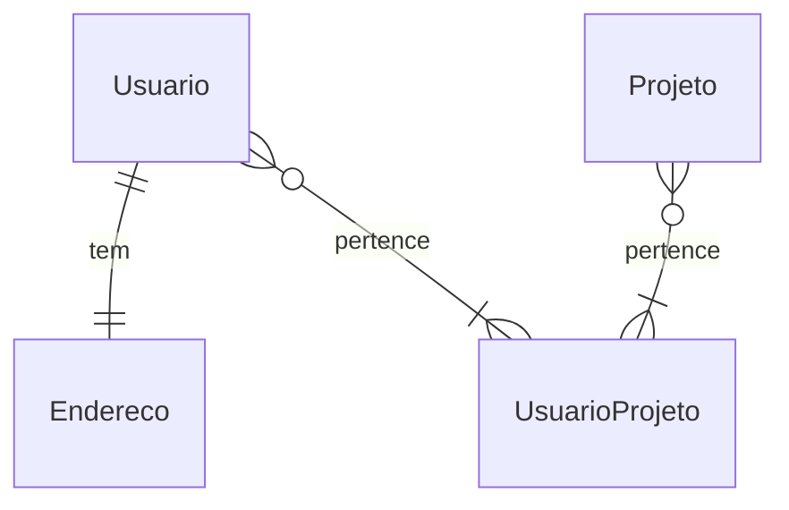

# Contagem de Pontos de Função

## Modelo de Dados 

### Contagem Indicativa

| Função de Dado     | Entidades Relacionadas | Tamanho em PF |
| ------------------ | ---------------------- | :-----------: |
| ALI Usuário        | Usuario                | 35 PF         |
| ALI Projeto        | Projeto                | 35 PF         |
| ALI UsuarioProjeto | UsuarioProjeto         | 35 PF         |
| AIE Endereço       | Endereço               | 15 PF         |
| **Total**          | **Ci**                 | **120 PF**    |

### Contagem Detalhada (Cd)

|     Descrição       |   Tipo   |   RLR   |   DER   |   Complexidade   |   Tamanho em PF   |
| ------------------- | -------- | ------- | ------- | ---------------- | :---------------: |
|  ALI Usuário        |   ALI    |    2    |    8    |       Baixa      | 7 PF              |
|  ALI Projeto        |   ALI    |    1    |    5    |       Baixa      | 7 PF              |
|  ALI UsuarioProjeto |   ALI    |    2    |    3    |       Baixa      | 7 PF              |
|  AIE Endereço       |   AIE    |    1    |    7    |       Baixa      | 5 PF              |
|  **Descrição**      | **Tipo** | **ALR** | **DER** | **Complexidade** | **Tamanho em PF** |
|  Criar usuário      |    EE    |    1    |    3    |      Baixa       | 2 PF              |
|  Apagar Usuário     |    EE    |    1    |    2    |      Baixa       | 2 PF              |
|  Consultar Usuário  |    CE    |    1    |    2    |      Baixa       | 3 PF              |
|  Atualizar Usuário  |    EE    |    2    |    15   |      Baixa       | 3 PF              |
|   **Total**         |          |         |         |     **Cd**       | **36 PF**         |

