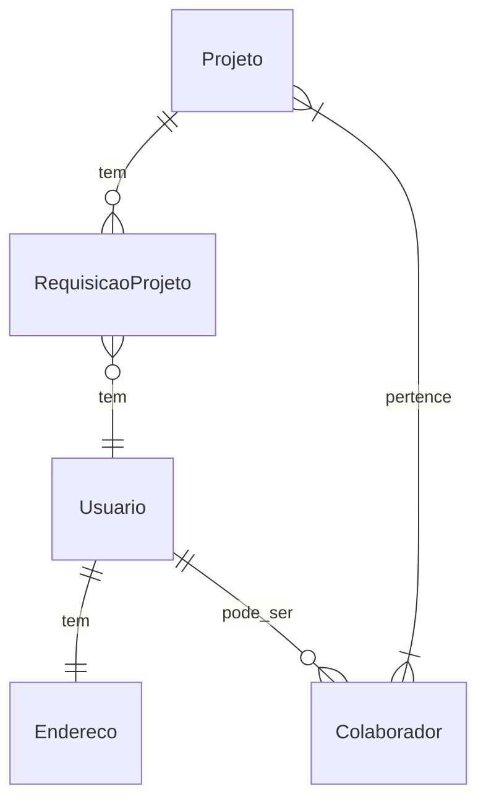

# Contagem de Pontos de Função

## Modelo de Dados 

### Contagem Indicativa

| Função de Dado        | Entidades Relacionadas | Tamanho em PF |
| --------------------- | ---------------------- | :-----------: |
| ALI Usuário           | Usuario                | 35 PF         |
| ALI Projeto           | Projeto                | 35 PF         |
| ALI Colaborador       | Colaborador            | 35 PF         |
| ALI RequisicaoProjeto | RequisicaoProjeto      | 35 PF         |
| AIE Endereço          | Endereço               | 15 PF         |
| **Total**             | **Ci**                 | **155 PF**    |

### Contagem Detalhada (Cd)

|     Descrição          |   Tipo   |   RLR   |   DER   |   Complexidade   |   Tamanho em PF   |
| ---------------------- | -------- | ------- | ------- | ---------------- | :---------------: |
|  ALI Usuário           |   ALI    |    2    |    8    |       Baixa      | 7 PF              |
|  ALI Projeto           |   ALI    |    1    |    5    |       Baixa      | 7 PF              |
|  ALI Colaborador       |   ALI    |    2    |    3    |       Baixa      | 7 PF              |
|  ALI RequisicaoProjeto |   ALI    |    2    |    4    |       Baixa      | 7 PF              |
|  AIE Endereço          |   AIE    |    1    |    7    |       Baixa      | 5 PF              |
|  **Descrição**         | **Tipo** | **ALR** | **DER** | **Complexidade** | **Tamanho em PF** |
|  Criar usuário         |    EE    |    1    |    4    |      Baixa       | 2 PF              |
|  Apagar Usuário        |    EE    |    1    |    2    |      Baixa       | 2 PF              |
|  Consultar Usuário     |    CE    |    1    |    2    |      Baixa       | 3 PF              |
|  Atualizar Usuário     |    EE    |    2    |    15   |      Baixa       | 3 PF              |
|  Criar projeto         |    EE    |    1    |    5    |      Baixa       | 2 PF              |
|  Apagar projeto        |    EE    |    1    |    2    |      Baixa       | 2 PF              |
|  Consultar projeto     |    CE    |    1    |    2    |      Baixa       | 3 PF              |
|  Atualizar projeto     |    EE    |    2    |    5    |      Baixa       | 3 PF              |
|  Adicionar colaborador |    EE    |    1    |    2    |      Baixa       | 2 PF              |
|  Apagar colaborador    |    EE    |    1    |    2    |      Baixa       | 2 PF              |
|  Recusar colaborador   |    CE    |    1    |    2    |      Baixa       | 3 PF              |
|   **Total**            |          |         |         |     **Cd**       | **53 PF**         |

