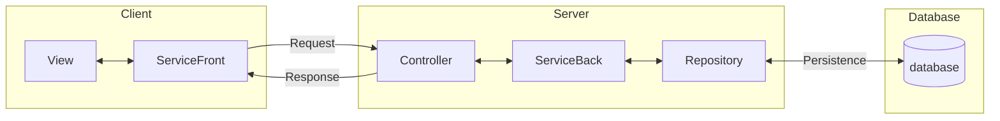

# Documento de Projeto Arquitetural

Neste documento temos o projeto arquitetural do sistema, e uma breve descrição de cada componente.

## Diagrama 

## Descrição

| Componente   | Tecnologia            | Descrição
| ------------ | --------------------- | ---------
| View         | ReactJS               | Criação de componentes visuais para a tela
| ServiceFront | Axios                 | Comunicação via HTTP com a API
| Controller   | ASP.Net               | Servidor para receber as requisições HTTP
| ServiceBack  | C#                    | Comunicação entre Controller e Repository
| Repository   | Entity Framework Core | ORM para fazer comunicação com o banco de dados
| Database     | MS SQL Server         | Banco de dados para guardar as informações salvas
