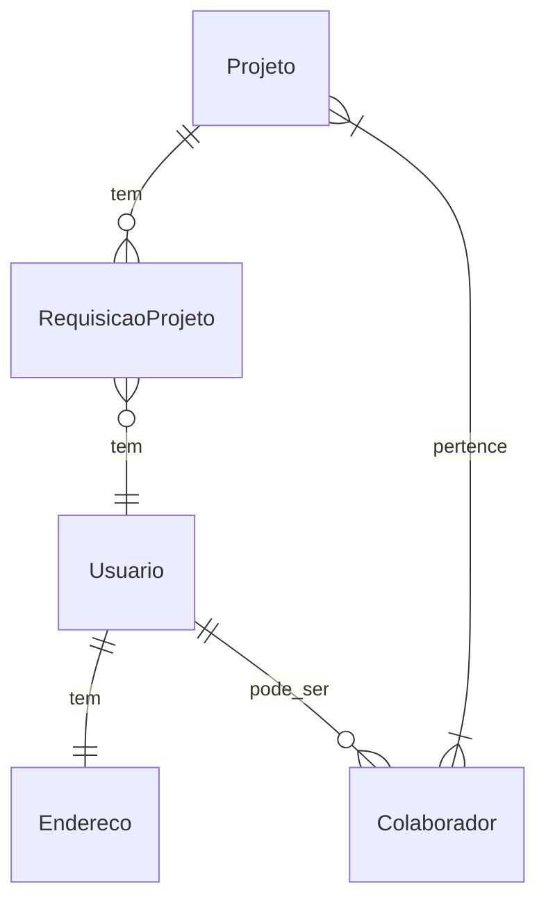

# Documento de Modelos

Neste documento temos o Modelo de Dados (Entidade-Relacionamento). Temos também a descrição das entidades e o dicionário de dados.

## Modelo Conceitual

### Modelo de Dados (Entidade-Relacionamento) usando Mermaid

### Descrição das Entidades

Descrição sucinta das entidades presentes no sistema.

| Entidade          | Descrição                                                                                                                                            |
| ----------------- | ---------------------------------------------------------------------------------------------------------------------------------------------------- |
| Usuario           | Entidade abstrata para representar informações gerais dos Usuários: id, nome, data_nasc, telefone, email, linkedin, github, endereco e username.     |
| Endereco          | Entidade que representa um Endereço tem as informações: id, rua, numero, bairro, cidade, estado, cep, complemento.                                   |
| Projeto           | Entidade que representa um Projeto tem as informações: id, titulo, descricao, discord e dono.                                            |
| RequisicaoProjeto | Entidade que irá persistir as requisições de colaboradores para participarem de um projeto, tem as informações: id, usuario, projeto e status.       |
| Colaborador       | Entidade que representa o relacionamento entre usuário e projeto tem as informações: id, usuario e projeto.                                          |

### Dicionário de Dados

|   Tabela   | Usuario                                                    |
| ---------- | ---------------------------------------------------------- |
| Descrição  | Armazena as informações de um usuário.                     |
| Observação | Usuários podem ser proprietário de projeto ou colaborador. |

|  Nome         | Descrição                          | Tipo de Dado | Tamanho | Restrições de Domínio |
| ------------- | ---------------------------------- | ------------ | ------- | --------------------- |
| id            | identificador gerado pelo ORM      | SERIAL       | ---     | PK / Identity         |
| data_nasc     | data de nascimento do usuário      | DATE         | ---     | Not Null              |
| nome          | nome do usuário                    | VARCHAR      | 150     | Not Null              |
| senha         | senha do usuário                   | VARCHAR      | 150     | Not Null              |
| telefone      | telefone do usuário                | VARCHAR      | 150     | Not Null              |
| linkedin      | Url para LinkedIn do usuário       | VARCHAR      | 150     | ---                   |
| github        | nome de usuário do GitHub          | VARCHAR      | 150     | ---                   |
| e-mail        | e-mail de contato do usuário       | VARCHAR      | 150     | Not Null              |
| endereco      | endereço vinculado ao usuário      | SERIAL       | ---     | FK / Not Null         |
| username      | nome de usuário para login         | VARCHAR      | ---     | FK / Not Null         |

|   Tabela   | Endereco                                                    |
| ---------- | ----------------------------------------------------------- |
| Descrição  | Armazena as informações de endereço referente a um usuário. |
| Observação | ---                                                         |

|  Nome         | Descrição                          | Tipo de Dado | Tamanho | Restrições de Domínio |
| ------------- | ---------------------------------- | ------------ | ------- | --------------------- |
| id            | identificador gerado pelo ORM      | SERIAL       | ---     | PK / Identity         |
| rua           | rua do endereço do usuário         | VARCHAR      | 150     | Not Null              |
| numero        | numero do endereço do usuário      | VARCHAR      | 150     | Not Null              |
| bairro        | bairro do endereço do usuário      | VARCHAR      | 150     | Not Null              |
| cidade        | cidade do endereço do usuário      | VARCHAR      | 150     | Not Null              |
| estado        | estado do endereço do usuário      | VARCHAR      | 150     | Not Null              |
| cep           | cep do endereço do usuário         | VARCHAR      | 150     | Not Null              |
| complemento   | complemento do endereço do usuário | VARCHAR      | 150     | ---                   |

|   Tabela   | Projeto                                                    |
| ---------- | ---------------------------------------------------------- |
| Descrição  | Armazena as informações de um projeto.                     |
| Observação | Um projeto pode ter mais de um colaborador e tecnologia.   |

|  Nome         | Descrição                              | Tipo de Dado | Tamanho | Restrições de Domínio |
| ------------- | -------------------------------------- | ------------ | ------- | --------------------- |
| id            | identificador gerado pelo ORM          | SERIAL       | ---     | PK / Identity         |
| descricao     | detalhes sobre o projeto               | VARCHAR      | 250     | ---                   |
| titulo        | título do projeto                      | VARCHAR      | 150     | Not Null              |
| discord       | Discord do projeto                     | VARCHAR      | 150     | ---                   |
| dono          | usuário vinculado ao projeto como dono | SERIAL       | ---     | FK / Not Null         |

|   Tabela   | Colaborador                                                       |
| ---------- | ----------------------------------------------------------------- |
| Descrição  | Armazena as informações do tipo de usuário do projeto.            |
| Observação | ---                                                               |

|  Nome         | Descrição                          | Tipo de Dado | Tamanho | Restrições de Domínio |
| ------------- | ---------------------------------- | ------------ | ------- | --------------------- |
| id            | identificador gerado pelo ORM      | SERIAL       | ---     | PK / Identity         |
| usuario       | usuário vinculado ao projeto       | SERIAL       | ---     | FK / Not Null         |
| projeto       | projeto vinculado ao usuario       | SERIAL       | ---     | FK / Not Null         |

|   Tabela   | RequisicaoProjeto                                                |
| ---------- | ----------------------------------------------------------------- |
| Descrição  | Armazena as informações das solicitações de ingresso em projetos. |
| Observação | ---                                                               |

|  Nome         | Descrição                          | Tipo de Dado | Tamanho | Restrições de Domínio |
| ------------- | ---------------------------------- | ------------ | ------- | --------------------- |
| id            | identificador gerado pelo ORM      | SERIAL       | ---     | PK / Identity         |
| status        | status atual da requisição         | INT          | ---     | Not Null              |
| usuario       | usuário vinculado ao projeto       | SERIAL       | ---     | FK / Not Null         |
| projeto       | projeto vinculado ao usuario       | SERIAL       | ---     | FK / Not Null         |
